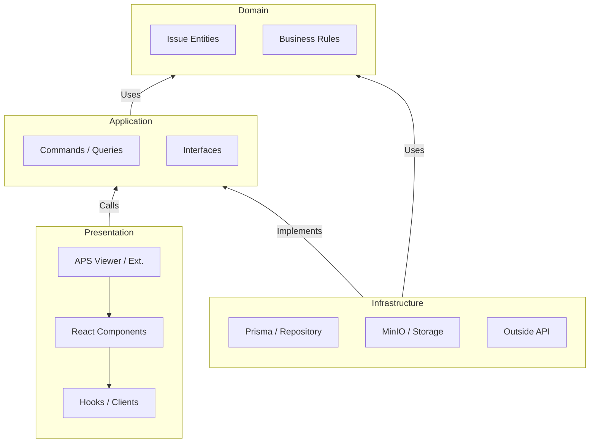
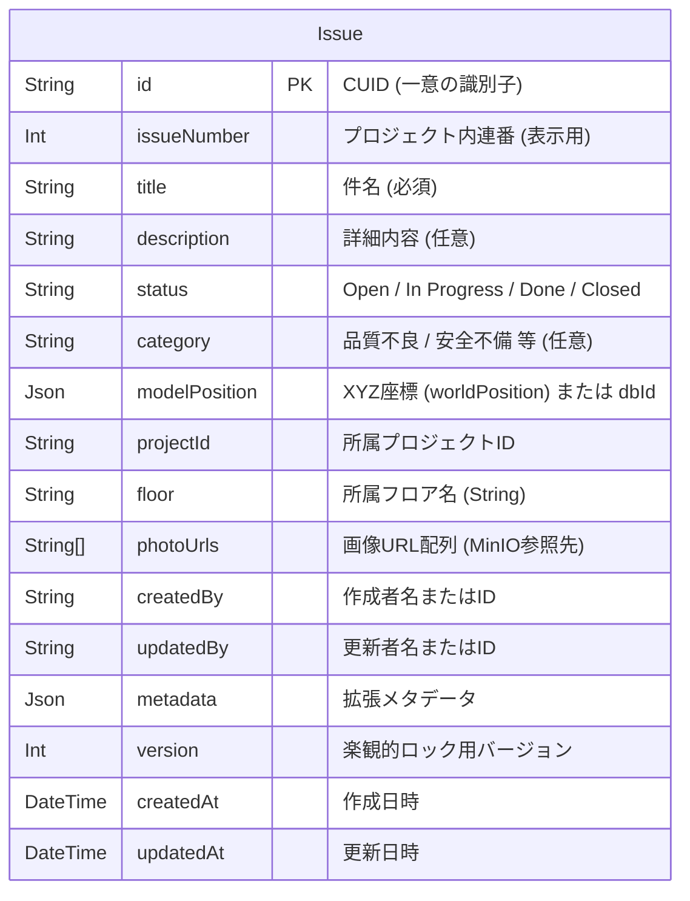
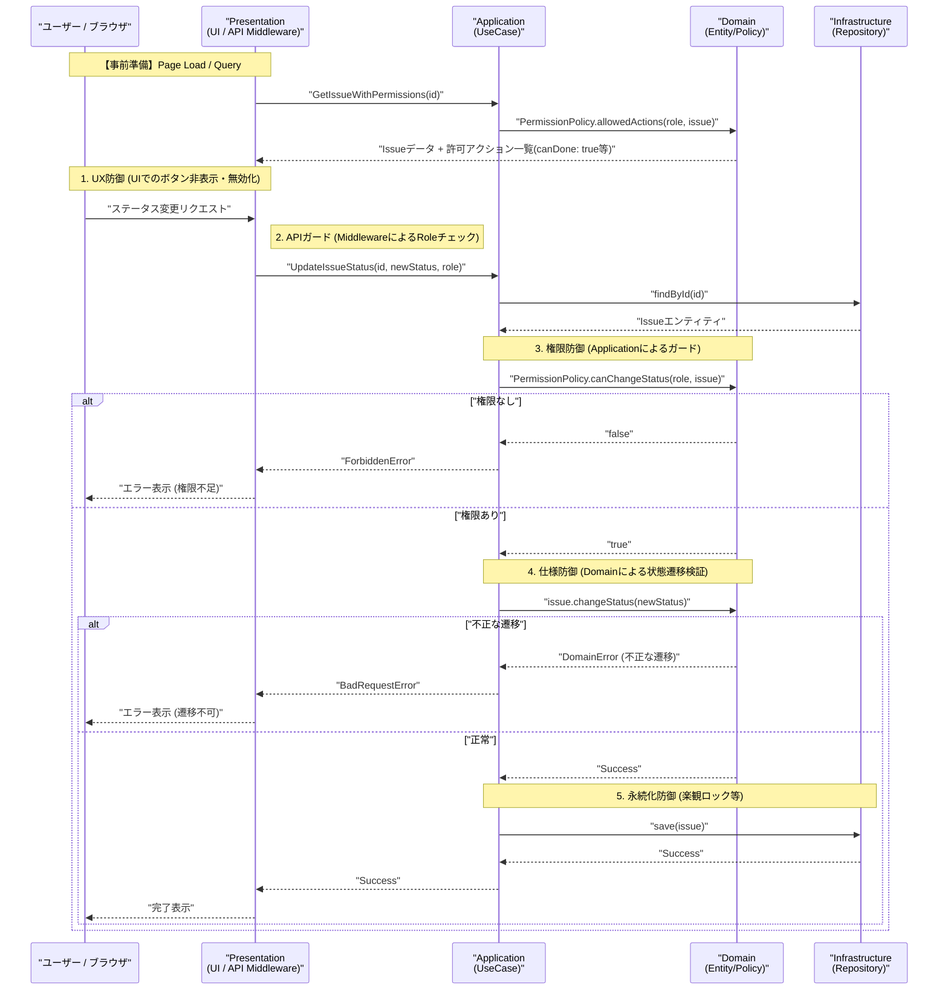

# アーキテクチャ設計書

## 1. 全体方針
本アプリケーションは、将来的なクラウド移行、多テナント化、および保守性を高めるため、**クリーンアーキテクチャ**の考え方に基づいたレイヤー構造を採用します。
また、フロントエンドとバックエンドの親和性を高めるため、**Next.js API Routes** にバックエンド機能を統合し、TypeScript で統一します。

### 全体アーキテクチャ図（レイヤー構造とコンポーネントの対応）
物理的なコンポーネント（Next.js, DB等）がクリーンアーキテクチャのどの層に相当し、どのように依存しているかを整理しました。

## 2. レイヤー構成と責務の対応
図の各部と役割の対応表です。

| レイヤー | 物理的な構成要素 | 主な役割 |
| :--- | :--- | :--- |
| **Presentation** | `app/`, `components/`, `components/viewer/extensions/` | UIの構築、APS Viewerの制御、ブラウザからのリクエスト送信 |
| **Infrastructure** | `infrastructure/` (Prismaクライアント, MinIOクライアント) | データベースへの実保存、ファイルアップロードの実処理 |
| **Application** | `application/` (UseCases, Interfaces) | 指摘事項の作成・更新などの「手順」の定義。DB操作などはInterfaceに抽象化 |
| **Domain** | `domain/` (Entities, ValueObjects) | 指摘事項のデータ構造（タイトル、位置等）と、状態遷移（Open→Done等）のルール。**他の一切に依存しない** |

- **依存方向**: Presentation/Infrastructure → Application → Domain (内側の Domain が何にも依存しない)
- **外部依存の隔離**: データベース (Prisma等) やストレージ、APS Viewer API との直接の依存は Infrastructure および Presentation の末端に限定し、Application/Domain はインターフェースを介してやり取りします。

## 3. データベース設計 (ER図とスキーマ方針)

本システムは、BIMデータ(外部)と独自データ(指摘)を疎結合に保つため、**あえて過剰な正規化（マスタテーブル化）を行わないフラットな設計**を採用しています。

### ER図 (Entity-Relationship Diagram)

### スキーマの設計思想（フラットアーキテクチャ）
*   **外部データに依存しない設計**: BIMデータ(外部システム)の階層構造（Project/Floor等）や他システムリソース(Photo URL等)を独自のマスタとして管理せず、Issueテーブル内の単一文字列（または文字列配列）として保持します。
    *   **Project**: `projectId: String` として保持。外部システム(APS等)側のプロジェクト識別子をそのまま保持し、独自のProjectマスタとの紐付けを排除します。
    *   **Floor**: `floor: String` として保持。階層マスタへの依存をなくします。
    *   **Photo**: `photoUrls: String[]` として保持。画像URLのリストを直接配列で持たせます。
*   **非依存・疎結合の原則**: フロア名（"4F"や"PIT"など）やプロジェクトIDを外部キーに縛られないプレーンなテキストとして扱うことで、事前に存在しない名称が外部システムから投入された場合でもシステムがエラーを起こさず柔軟に受け入れることができます。将来的にどんな外部データ構造モデルが読み込まれても堅牢に対応可能なデータ保存を実現しています。

## 4. ドメイン設計 (Issue)
### Issue エンティティ
- **属性**:
    - **基本**: ID, Title (指摘の件名), Description (詳細テキスト), CreatedAt, UpdatedAt, **Version** (楽観ロック用)
    - **ユーザー**: CreatedBy (作成者), UpdatedBy (最終更新者)
    - **状態/分類**: Status (Open/In Progress/Done), Category (品質/安全/施工/設計変更等)
    - **位置**: Location (worldPosition または dbId), Floor (所属フロア文字列), URN (関連モデル)
    - **メディア**: Photos (Blob Storage 参照 URL 文字列配列)
    - **拡張属性**: **Metadata** (JSONB形式。任意の拡張属性を保持)
- **状態遷移 (Status)**: `Open` (初期値) -> `In Progress` -> `Done`
    - ビジネスルールに基づき、各遷移時のバリデーションや権限チェックをドメインモデルに集約します。

## 4. 読み取りと書き込みの分離 (CQRS)
本システムでは、複雑なビジネス要件（権限、状態遷移）を伴う「書き込み」と、速度やUIへの適応が求められる「読み取り」の要求・実装パターンを分離しています。

### 1. Command (書き込み系)
Commandは、システムの状態を変更する操作（作成・更新・削除）を担当します。
- **実装方法**: `application/use-cases/` に専用のクラス（例: `CreateIssueUseCase`）として実装されます。
  1. 引数としてプレーンなオブジェクト（Command DTO）を受け取る。
  2. ドメインエンティティ (`Issue`) を再構成（または新規作成）する。
  3. エンティティのメソッドを呼び出し、**ドメインのビジネスルール（権限チェックや状態遷移の妥当性）を厳格に実行**する。
  4. Repository（`infrastructure/persistence`）を介して永続化する。
- **呼び出し経路**: 
  - Presentation層（`app/api/.../route.ts` の `POST`, `PATCH`, `DELETE` メソッド）がリクエストを受け取る。
  - DBアクセスを隠蔽したリポジトリインスタンスなどをUseCaseに注入（DI）して `new CreateIssueUseCase(repo).execute(command)` のように呼び出す。

### 2. Query (読み取り系)
Queryは、画面表示などのためにデータを取得する操作を担当します。
- **実装方法**: `application/use-cases/` に専用のクラス（例: `GetIssuesByFloorQuery`）として実装されます。
  1. 取得用のパラメータ（floor名など）を受け取る。
  2. 複雑なドメインエンティティの生成やビジネスルールの検証を**スキップ**し、RepositoryまたはPrismaから直接必要なデータを素早く取得する。
  3. フロントエンド（UI）が使いやすい形式（JSON DTO）にマッピングして即座に返却する。
  - *※現状はRepositoryを介していますが、パフォーマンス要件が厳しくなった場合はDomain層を完全にバイパスして直接Readモデル(SQLやPrisma select)を叩く形へ拡張できる設計です。*
- **呼び出し経路**: 
  - Presentation層（`app/api/.../route.ts` の `GET` メソッド）がリクエストを受け取る。
  - パラメータを渡し `new GetIssuesByFloorQuery(repo).execute(floor)` を実行してUIに返却する。

### 実装されている主な Command / Query 一覧
- **Commands**:
    - `CreateIssue`: 新規指摘の作成（Statusは自動でOpen）。
    - `UpdateIssue`: Title, Description, Category 等の更新。
    - `ChangeIssueStatus`: ステータス変更の実行（ドメイン権限チェックを含む）。
- **Queries**:
    - `GetIssuesByFloor`: 選択されたフロアに紐づく指摘一覧の取得。
    - `GetIssueDetail`: 特定の指摘の全情報取得。

## 5. 同時編集と整合性
### 排他制御 (Concurrent Edit Prevention)
- **楽観的ロック (Optimistic Locking)**: 各 Issue に `version` を持たせ、更新時にバージョンが一致することを確認します。不整合（他ユーザーによる上書き）を検知した場合は `ConcurrencyError` を投げ、ユーザーに通知します。

## 6. 永続化と外部ストレージ
### Repository パターン
- `IIssueRepository`: 指摘事項の保存・取得を抽象化。
- `IBlobStorageService`: 画像ファイルの保存・取得を抽象化。
- **整合性管理**: DBへのレコード保存と Blob Storage へのアップロードにおいて、整合性が崩れないよう「DB保存成功後に書き込み」または「失敗時のクリーンアップ」戦略を Application 側で制御します。

### ローカル開発環境 (Docker Compose)
- **PostgreSQL**: データの永続化。
- **MinIO**: S3 互換のオブジェクトストレージ。
- **Next.js App**: API Routes を含む本体。

## 6. APS Viewer との連携
- **APS Extension** (`components/viewer/extensions/IssueExtension.ts`):
    - **Interaction Tool**:
        - **部材クリック**: 部材のdbIdを指摘事項の位置情報とし、指摘作成ダイアログを表示（ピンは部材の中心/基準位置を指す）。
        - **部材の無い場所クリック**: クリック位置のworldPositionを位置情報とし、指摘作成ダイアログを表示（クリック位置から最も近い部材と同じカメラ距離として3次元座標を算出）。
        - **ピンクリック**: 指摘詳細ビューの前面表示。
    - **マーカー描画**: Viewerの `overlays` シーン（`issue-markers`）を使用し、球形と円錐を組み合わせた形（Pushpin型）で指摘位置を可視化。円錐の頂点が位置情報を指す。ピン同士が近接する場合は球形のみ移動する。ステータスに応じて色が変化。
    - **ズーム機能**: `navigation.setView()` により、マーカーに向かってカメラを移動。
- **相互参照**:
    - 一覧で選択 → Viewer は `zoomToIssue()` を実行し対象マーカーへカメラを移動。

## 7. エラーハンドリングと防衛的設計 (Defensive Design)
単なる「正常に動作する」ことだけでなく、「予期せぬ事態（APIダウン、ネットワークエラー、バリデーション違反）が発生した際に、システムがどう振る舞い、ユーザーにどうフィードバックするか」を設計の基本方針とします。

1. **設計の原則 (Fail-Safe & Feedback)**
   - 全てのユーザーアクション（作成、更新、削除、取得）に対し、少なくとも1つの異常系シナリオ（Unhappy Path）を想定し、その際の状態遷移を定義する。
   - 例: 指摘事項の作成中 (`POST /api/issues`) に 500 エラーが発生した場合、ダイアログは開いた状態を維持し、ユーザーが再試行できるようエラーメッセージをインラインで表示する。

2. **実装の原則 (Defensive Programming)**
   - API呼び出し時には常に `try...catch` および `res.ok` のチェックを行い、例外や非正常ステータスを握りつぶさず（単なる `console.error` による放置を禁止）、UIの状態（State）に反映させる。
   - 処理中 (Loading/Submitting) の状態管理を徹底し、二重送信を防止する。

3. **テストの原則 (Fault Injection)**
   - 正常系テストと同等の比重で、異常系テストを各テストレイヤーで実施する。
   - E2Eテストでは、モックを利用して意図的にAPIエラー（ステータス500やネットワーク切断）を発生させ、エラーUIが正しくレンダリングされるかを検証する。

## 8. ユーザー役割と権限管理 (RBAC)
現状のシステムでは、ログイン機能や複雑な認証基盤（Auth0等）は持たず、API層（API Routes）において検証用に固定のRole（現在は `userRole: 'Admin'`）をUseCaseに渡すというシンプルな仮の実装となっています。
ここで定義・抽出された `userRole` は、常に Application 層（UseCase）の引数としてドメインへ渡され、以下の多層防御の仕組みに入力されます。

### 役割ベースの権限管理と多層防御
役割（Role）に応じた操作権限のコントロールを以下の 3 層で防御・実装します。

#### 1. ロジックの実装場所
| レイヤー | 実装内容 | 役割 |
| :--- | :--- | :--- |
| **Domain** | `PermissionPolicy` / `Specifications` | 「どの役割がどの操作を許可されるか」という**ビジネスルール自体の定義**。 |
| **Application** | ユースケース内でのガード節 | 実行直前にドメインのルールを呼び出し、**操作の実行を確実に阻止**する。 |
| **Presentation** | UIの表示制御 (Next.js) | 権限不足のボタンを非表示にするなど、**ユーザー体験 (UX) の維持**。 |

#### 2. ロジック違反を防止する仕組み（多層防御）
- **UseCase単位の強制チェック:** すべての書き込み操作（Command）は、冒頭で権限チェックを通過しなければロジックが動かない構造（抽象クラスや共通ガード）にします。
- **ドメインエンティティの自己防衛:** `issue.changeStatus(role)` のように、エンティティ内部で状態遷移と権限をセットで検証し、不正な状態への遷移を技術的に不可能にします。
#### 3. 状態変更における権限・防御フロー
「指摘事項の状態変更（例: Open -> Done）」を例に、各レイヤーでの防御とルール参照のタイミングを図示します。

#### 「UX防御」の根拠と場所についての補足
「UX防御」は、ユーザーが不正な操作（権限のない操作）を試みてエラーに直面することを防ぐための「配慮」としての防御です。

1.  **根拠（何をもとに判断するか）**:
    - **認証トークンに含まれる Role**: ログイン時に付与されたユーザーの役割。
    - **Query 側で付与された権限メタデータ**: 読み取りリクエスト（GetIssue）の際、Domain 層の `PermissionPolicy` が判断した「そのユーザーができる操作」の結果（例：`canEdit: true`）をフロントエンドに渡します。
2.  **実行場所（どこで行うか）**:
    - **UI層 (React)**: 上記のメタデータを参照し、ボタンを非表示（Hidden）にしたり、クリック不可（Disabled）にします。
    - **API Middleware (Next.js)**: リクエストを受信した直後、ユースケースを呼び出す前に、トークン内の役割とターゲットパスを照合して簡易的な拒否（Early Return 403）を行います。

**重要**: UX防御はあくまで快適さのための「表層の防御」であり、実際のデータの整合性とセキュリティは **3. 権限防御（Application）** と **4. 仕様防御（Domain）** で担保します。これにより、APIを直接叩くような不正アクセスも確実に阻止されます。

## 9. 拡張性への考慮
本システムは、将来的なビジネス要求の拡大やスケーラビリティの課題に対応できるよう、以下の設計上の「のり代」を持たせています。現時点では未実装の将来構想であっても、既存のコアロジック（Domain層・Application層）を破壊せずに拡張可能です。

### 9.1 認証基盤の強化 (Auth0, NextAuth.js 等への移行)
- **将来の要件**: 現在UIから擬似的に送信しているRole（役割）を、外部のIdentity Provider (IDP) やエンタープライズの SSO (Azure AD 等) に置き換える。
- **現在の設計の対応力**: 「8. ユーザー役割と権限管理」で定義した通り、認証と権限の解決を Presentation 層（API Routes）と境界づけています。将来 NextAuth 等を導入しても、変更されるのは「サーバーサイドでセッションから `userRole` を抽出するミドルウェア部分」のみです。抽出されたRoleを受け取る UseCase や Domain 層の権限チェックロジックは一切変更せずにそのまま流用可能です。

### 9.2 SaaS化 / マルチテナント対応
- **将来の要件**: 複数の企業や独立したプロジェクト群を1つのシステムでホスティングし、データが混ざらないように分離する。
- **現在の設計の対応力**: 現在のフラットスキーマ設計において、`Issue` モデルに直接 `projectId` (文字列) を持たせています（独自マスタに依存しない）。そのため、これを `tenantId` 的なパーティションキーとして安全に扱うことが容易です。また、CQRSにより Query 系クラス（データ取得）が独立しているため、そこにテナント境界を強制するフィルタリングロジックを一元的に追加するだけで実装できます。

### 9.3 排他制御とキャッシュ層の導入 (Redis等)
- **将来の要件**: 同時接続ユーザーが増加し、BIMモデル上で複数人が同時に同じ指摘事項を編集しようとした際のリアルタイムな警告（ロック状態の共有）や、一覧取得の高速化。
- **現在の設計の対応力**: データ自体の競合整合性は、既にDBレベルの「楽観的ロック（`version`カラム）」で強固に担保されています。将来的にRedis等を用いた「現在編集中フラグ」機能を足す場合も、プレゼンテーション層とユースケースの間にキャッシュ層を差し込むだけで済み、コアデータの保存トランザクションロジックを汚染しません。

### 9.4 描画パフォーマンスの最適化 (DataViz / SVG マーカーへの移行)
- **将来の要件**: 1モデルあたり数千〜数万件の指摘事項ピンが登録された際の、APS Viewer 上でのマーカー描画パフォーマンスの維持。
- **現在の設計の対応力**: UI層（Presentation）において、Reactの状態管理と APS Extension (描画) は疎結合に作られています。そのため、バックエンドが返すフラットな `modelPosition` (座標データ) さえ変わらなければ、現在の Three.js 球体マーカーから、軽量な `DataViz Extension` や 2D SVG マーカーの実装へと、フロントエンドの描画部分のみの差し替えで容易にアップグレード可能です。
