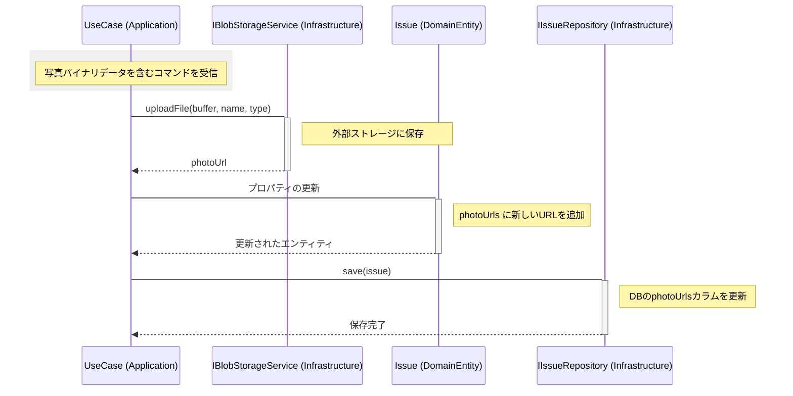

# ドメインレイヤー詳細設計書

本ドキュメントでは、Issue Manager アプリケーションにおけるドメインレイヤーの責務、モデル、および外部インターフェースについて記述します。

## 1. 概要
ドメインレイヤーは、アプリケーションのコアとなるビジネスロジックとエンティティを保持します。外部のフレームワークやライブラリ（Next.js, Prisma, MinIO等）に依存せず、純粋なビジネスルールをカプセル化することを目的とします。

## 2. 責務
- **ビジネスルールの表現**: 指摘事項（Issue）の状態遷移や属性変更のルールをエンティティ内に定義します。
- **権限ポリシーの管理**: ユーザーロールに基づいた操作の可否判定ロジック（ドメインサービス）を提供します。
- **不変条件の維持**: エンティティの整合性を保証します（例：完了済みの指摘を再開する際の権限チェックなど）。

## 3. ドメインモデル

### 3.1 Issue (エンティティ)
指摘事項を表す中心的なエンティティです。

#### 属性 (IssueProps)
| フィールド | 型 | 説明 |
| :--- | :--- | :--- |
| `id` | `string` (UUID) | 指摘事項の一意識別子 |
| `issueNumber` | `number` | 指摘番号（DBで自動採番、表示用） |
| `title` | `string` | 指摘事項のタイトル |
| `description` | `string` (optional) | 詳細な説明 |
| `status` | `IssueStatus` | ステータス（'Open', 'In Progress', 'Done'） |
| `category` | `string` (optional) | カテゴリ（例：品質不良、安全不備） |
| `modelPosition`| `IssueLocation` | 3Dモデル上のXYZ座標 |
| `dbId` | `number` (optional) | BIMモデル（Autodesk）の要素ID |
| `floor` | `string` | 階数（1F, 2F, 3F...） |
| `photoUrls` | `string[]` | 関連写真のURLリスト |
| `createdBy` | `string` | 作成ユーザーID |
| `updatedBy` | `string` | 最終更新ユーザーID |
| `version` | `number` | 楽観的ロック用バージョン番号 |
| `createdAt` | `Date` | 作成日時 |
| `updatedAt` | `Date` | 更新日時 |

#### 公開メソッド・インターフェース
- **`create(params)` (Static)**: 初期状態（Open, Version 1）の Issue インスタンスを生成します。
- **`update(params, userRole)`**: タイトルや説明などの一般属性を更新します。内部で `changeStatus` を呼び出す場合があり、更新のたびに `version` をインクリメントします。
- **`changeStatus(newStatus, userRole, updatedBy?)`**: ステータスを変更します。「完了済みを再開するには管理者のみ可能」といったビジネスルールが適用されます。
- **`toJSON()`**: 属性（IssueProps）をプレーンなオブジェクトとして返します。UI層やリポジトリ層でのデータアクセスに使用されます。
- **`id` (Getter)**: 指摘事項の UUID を取得します。
- **`status` (Getter)**: 現在の `IssueStatus` を取得します。
- **`version` (Getter)**: 現在のバージョン番号を取得します。
- **`createdBy` (Getter)**: 作成者のユーザー ID を取得します。

---

## 4. ドメインサービス

### 4.1 PermissionPolicy
ユーザーロールに基づいた詳細な権限判定を行います。ドメインレイヤー内のロジックですが、特定のエンティティに収まらない（ユーザーと指摘の複雑な関係）ためサービスとして分離されています。

#### ユーザーロール
- `Admin`: すべての操作（作成、編集、削除、ステータス変更）が可能。
- `Editor`: 自分が作成した指摘の編集、および新規作成が可能。
- `Viewer`: 閲覧のみ。編集や作成は不可。

#### メソッド (All Static)
- **`canCreate(role)`**: 作成権限チェック。
- **`canEdit(role, creatorId, requestingUserId)`**: 編集権限チェック。自身が作成者か、もしくは管理者である必要があります。
- **`canChangeStatus(role, currentStatus, nextStatus)`**: ステータス変更権限チェック。
- **`canDelete(role)`**: 削除権限チェック（現在はAdminのみ）。
- **`getAllowedActions(role, currentStatus, creatorId, requestingUserId)`**: 各種権限チェックを一括で行い、UI表示制御用のメタデータを返します。

---

## 5. 外部インターフェース (境界)
ドメインレイヤーが依存する外部システム（インフラストラクチャ）の型定義です。これらは `application/interfaces` に定義されています。

### 5.1 IIssueRepository
永続化層とのインターフェースです。

- `findById(id: string)`: IDによる単一取得。
- `findByFloor(floorId: string)`: フロア別の一覧取得。
- `save(issue: Issue)`: Issue エンティティの保存（新規・更新両用）。
- `delete(id: string)`: 指定 ID の削除。

### 5.2 IBlobStorageService
写真データなどのバイナリストレージとのインターフェースです。

- `uploadFile(buffer, fileName, contentType)`: ファイルをアップロードし、アクセス可能な URL を返します。
- `deleteFile(fileName)`: ファイルを削除します。

---

## 6. 写真データの追加フロー

ドメインレイヤーの外部（アプリケーション層）から指摘事項に対して写真データを追加する際の、オブジェクト間の相互作用を以下に示します。

### 6.1 処理の流れ
1. **アプリケーション層 (UseCase)**: クライアントから送られた写真のバイナリデータを含むコマンドを受信します。
2. **インフラ層 (BlobStorageService)**: インターフェースを介してストレージへアップロードし、公開URLを取得します。
3. **ドメイン層 (Issue Entity)**: 取得したURLをエンティティの属性（`photoUrls`）に追加します。
4. **インフラ層 (IssueRepository)**: URLが追加されたエンティティの状態をデータベースに保存します。

### 6.2 シーケンス図

---

## 7. データ整合性の担保

Blobストレージ（写真データ）とデータベース（指摘属性）の間のデータ整合性は、アプリケーション層のユースケースにおける **「処理実行順序」** によって管理されています。

### 7.1 整合性維持の仕組み
現在の実装では、以下の順序で非同期処理を実行しています。

1. **Blobアップロード (Storage)**: 最初に写真データをストレージに保存し、URLを取得します。
2. **Entity更新 (Domain)**: 取得したURLをエンティティにセットします。
3. **DB保存 (Database)**: 最後にエンティティの状態をDBに保存します。

この順序により、**「実体のない写真URLがDBに残る」という致命的な不整合を防いでいます**（Blob保存に失敗すれば、DB保存ステップには進まないため）。

### 7.2 既知の制限事項とリスク
分散システムにおける「2フェーズコミット」を導入していないため、以下のリスクが存在します。

- **孤立したBlob (Dangling Blobs)**:
    - Step 1（Blob保存）が成功し、Step 3（DB保存）が何らかの理由（コネクションエラーや楽観的ロックエラー）で失敗した場合、ストレージ上には存在するがDBからは参照されない「孤立したファイル」が残ります。
- **対策**:
    - 現時点では、運用上の利便性とシステムのシンプルさを優先し、これらの孤立Blobの発生を許容しています。将来的には、DB保存失敗時に `storageService.deleteFile()` を呼び出すロールバック処理や、定期的なクリーンアップバッチの実装を検討します。
